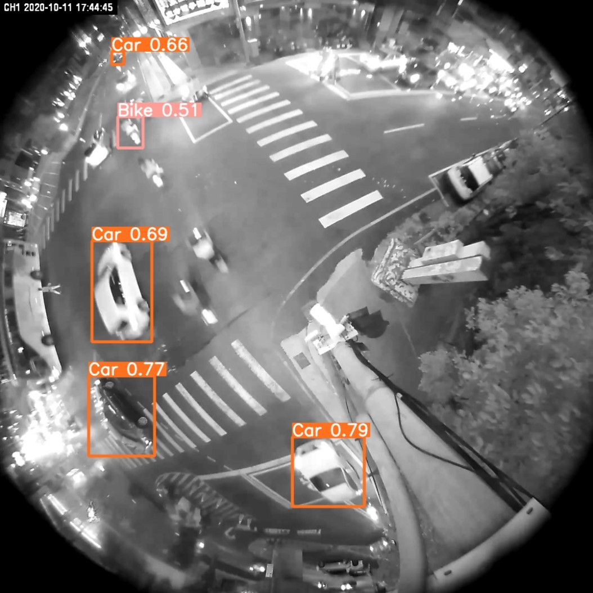
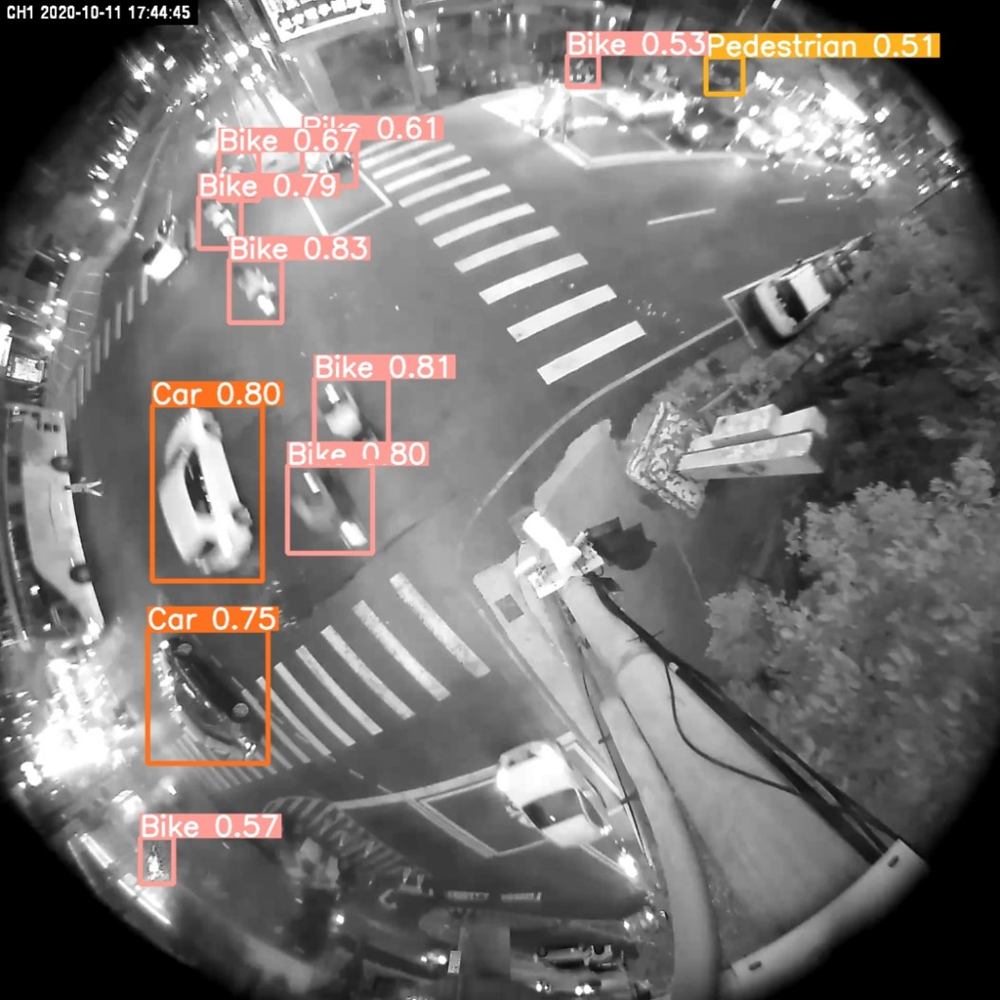

# Colored and BlackWhite Image Clustering and Transformation for YOLO model detection

### Before


### After


Before and After imgprocyolo Object Detection Results

### Goal and Approach

This repo automates the preprocessing of fisheye camera images by clustering them into blackwhite or colored images, however it should also work for other types of images. It uses KMeans clustering based on HSV saturation levels, splits images into their different cluster directories, and converts colored images to grayscale using OpenCV. You can then retrain YOLO models on an all blackwhite image set, which enhances object detection performance in night-time scenes.

### Environment

Please setup the environment as follows
```
conda create --name imgprocyolo python==3.8
conda activate imgprocyolo
conda install -c conda-forge opencv numpy tqdm
```
- Use bw_color_split.py to split and cluster your images into blackwhite vs color images
- Use transform.py to transform your color images to blackwhite for yolo retraining
- Use train_model to train however many yolo models you want
- Use validation.py and inference_1img.py to visualize metrics and inference results on an image.